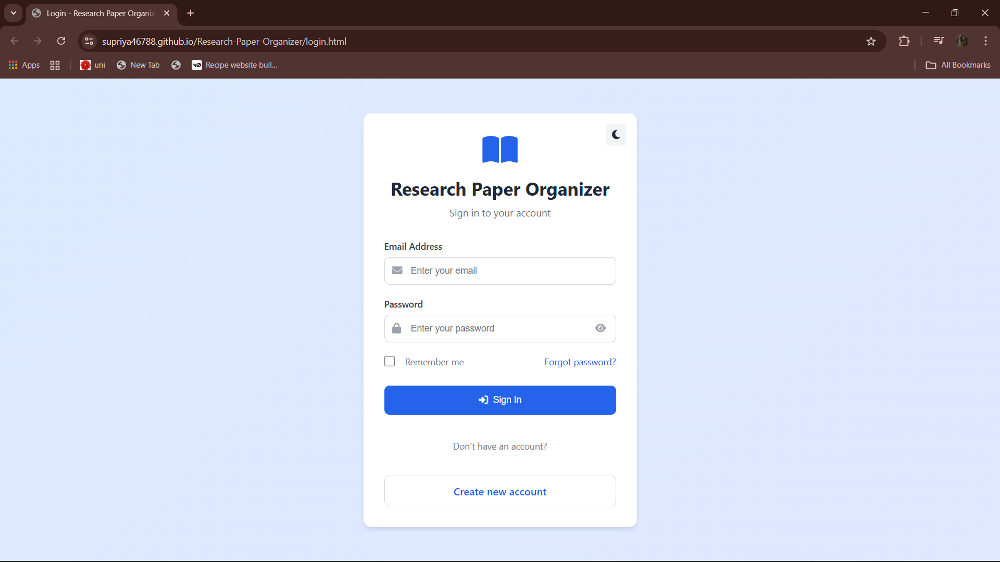
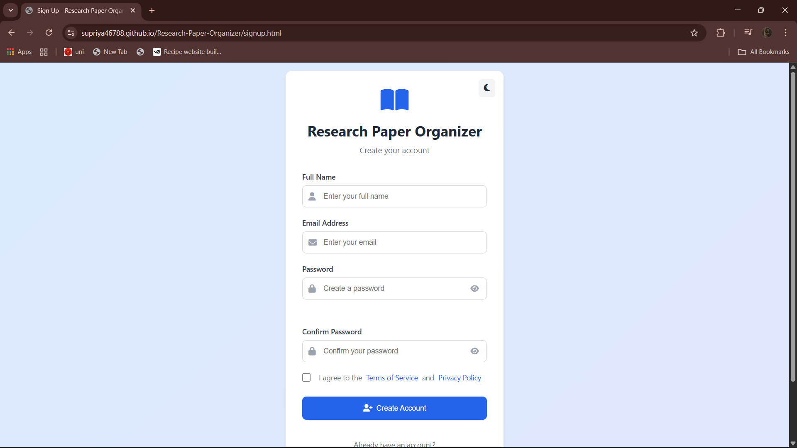
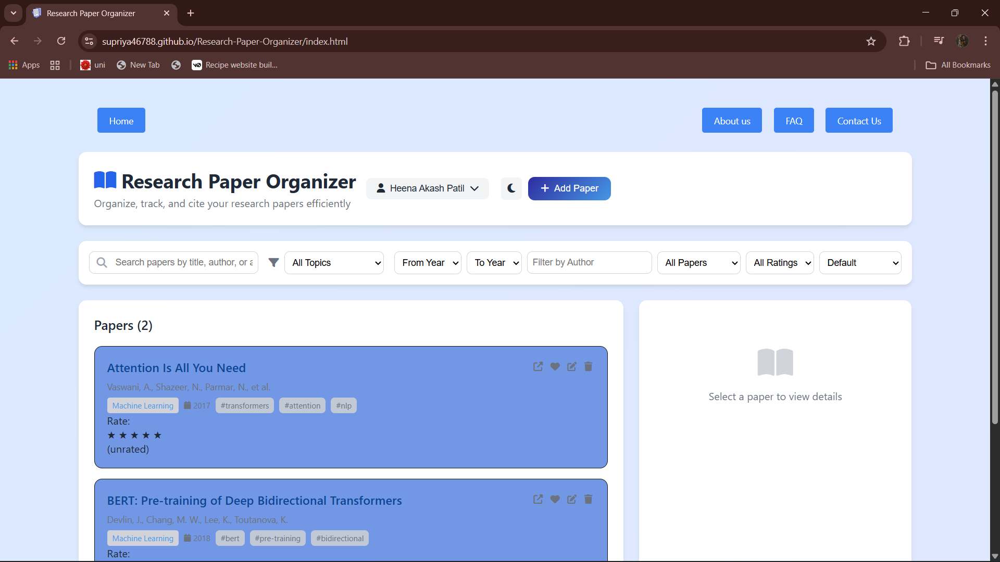
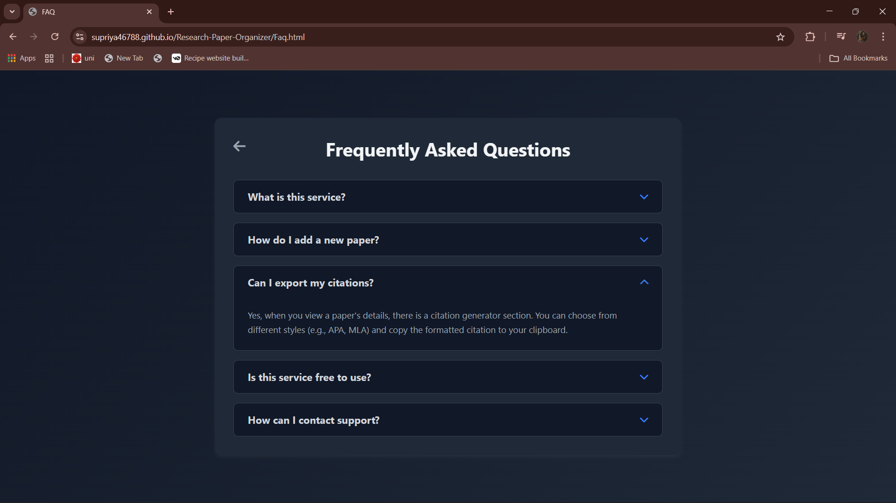
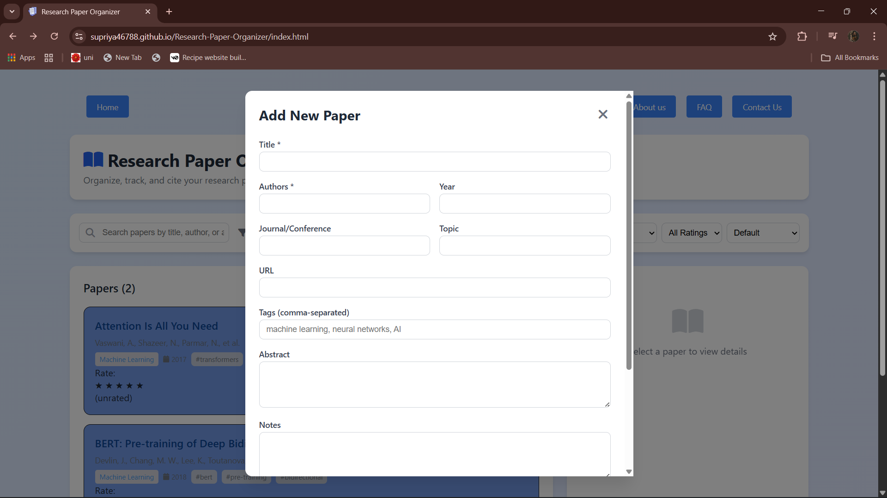
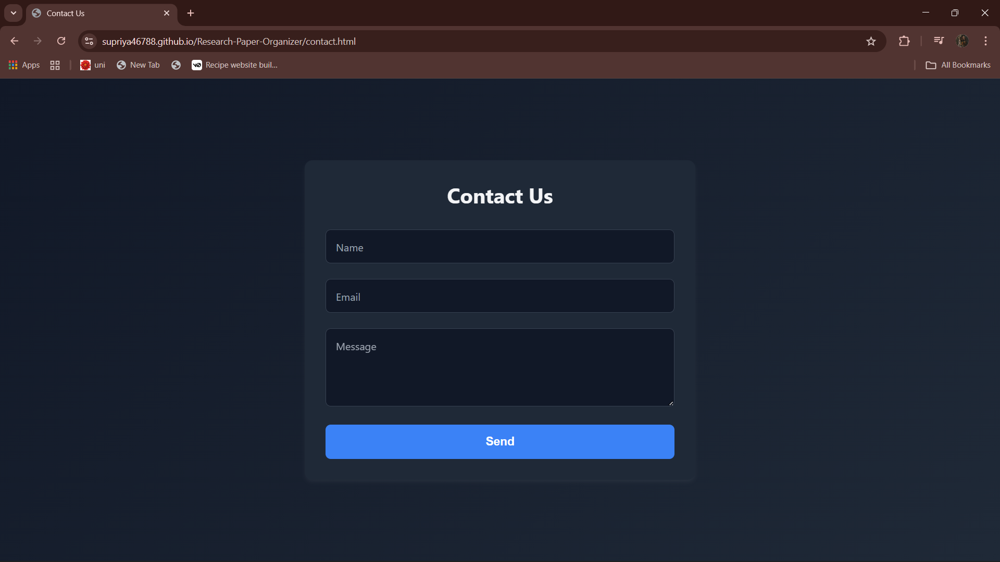

# 📚 Research Paper Organizer

A clean, minimal, and static web-based tool built using **HTML, CSS, and JavaScript** to help students, researchers, and professionals neatly **organize, categorize, and access** their research papers in one place.

> 🚀 This is an open-source beginner-friendly project aimed at promoting open collaboration, UI enhancement, and useful features like tagging, filtering, and paper previews.

---

## 📑 Table of Contents
- [Features](#-features)
- [Project Structure](#-project-structure)
- [How to Use](#-how-to-use)
- [Screenshots](#-screenshots)
- [Future Overview](#-future-overview)
- [Roadmap](#-roadmap-planned-features)
- [FAQ](#-faq)
- [How to Contribute](#-how-to-contribute)
- [Contribution Guidelines](#-contribution-guidelines)
- [License](#-license)

---

## ✨ Features

* 🎯 Static single-page application (SPA) with smooth UI
* 📁 Add and organize research paper entries
* 📇 Sort and filter by category (like AI, ML, Web, etc.)
* 🔍 Search bar to quickly find a paper
* 📌 Visual cards for each paper with title, author(s), and description
* 🎨 Built with pure HTML, CSS, and JavaScript – no frameworks

---

## 📁 Project Structure

```
research-paper-organizer/
├── favicon/
│ ├── android-chrome-192x192.png
│ ├── android-chrome-512x512.png
│ ├── apple-touch-icon.png
│ ├── favicon-16x16.png
│ ├── favicon-32x32.png
│ ├── favicon-48x48.png
│ ├── favicon.ico
│ └── site.webmanifest
│
├── Screenshots/
│ ├── Addpaper.png
│ ├── contact_us.png
│ ├── CreateAcc.png
│ ├── Faq.png
│ ├── HomePage.png
│ ├── Login.png
│ └── paperdetails.png
│
├── about.css
├── about.html
├── about.js
├── auth.css
├── auth.js
├── CODE_OF_CONDUCT.md
├── contact.css
├── contact.html
├── contact.js
├── CONTRIBUTING.md
├── faq.css
├── faq.html
├── faq.js
├── index.html
├── LICENSE.txt
```

---


## 💡 How to Use
```
1. Clone this repo:
   git clone https://github.com/supriya46788/Research-Paper-Organizer.git   
2. Open `index.html` in your browser (right click and open with live server).
3. Start adding your research papers directly.
```
---

## 📷 Screenshots

1. Login Page
  

2. Create Account
  

3.Home Page
  

4. FAQ page
  

5.Paper Detail 
  

6.Add Paper
  

7.Contact us
  

---

## 🔮 Future Overview

This project aims to become a **fully functional research management system** with features like:
- **Cloud Syncing** for research papers.
- **AI-based categorization** for auto-tagging papers.
- **PDF annotation** and in-browser reading.
- **Collaborator mode** for group research.
- **Integration with Google Scholar / Zotero**.

---

## 🛠️ Roadmap (Planned Features)

* Add localStorage support to save entries
* Add dynamic paper upload & preview
* Add PDF embedding and reading inside cards
* Responsive design for mobile view
* Dark mode toggle
* Convert to a fully dynamic app (React/Vanilla JS)
* Login/signup feature for cloud syncing

---

## ❓ FAQ

**Q1:** What is this service? 
**A1:** This is a research paper organizer and citation tool. It helps you manage your academic papers, add new ones, and generate citations in various formats.

**Q2:** How do I add a new paper?
**A2:** Click the "Add" button at the top of the homepage. You can manually enter the paper details or upload a PDF, and the system will attempt to auto-fill the information for you.

**Q3:** Can I export my citations?  
**A3:** Yes, when you view a paper's details, there is a citation generator section. You can choose from different styles (e.g., APA, MLA) and copy the formatted citation to your clipboard.   

**Q4:** Is this service free to use? 
**A4:** The basic features are completely free. We also offer premium plans with advanced features like cloud storage and collaborative tools.

---

## 🧑‍💻 How to Contribute

We welcome contributors of all skill levels! Here’s how to get started:

1. **Fork** the repository.
2. **Clone** your fork.
   ```bash
   git clone https://github.com/supriya46788/Research-Paper-Organizer.git
   ```
3. Create a new branch:
   ```bash
   git checkout -b your-feature-name
   ```
4. Make your changes and **commit**:
   ```bash
   git commit -m "Added feature XYZ"
   ```
5. **Push** the branch and create a **Pull Request**.

---

## 🔖 Contribution Guidelines

* Stick to clean and readable code
* Make small, well-documented pull requests
* For design changes, try to follow a minimal UI
* Always link issues you're solving
* Ask questions or open discussions freely in the Issues tab

---

## 📜 License

This project is licensed under the **MIT License** - see the [LICENSE.txt](LICENSE.txt) file for details.

---

## 🧑‍💻 Project Admin

**Supriya Pandey**  
[GitHub](https://github.com/supriya46788) • [LinkedIn](https://www.linkedin.com/in/supriyapandey595/)

---

## 🙌 Support & Star

If you like this project, **give it a ⭐** to support more such beginner-friendly repositories!
